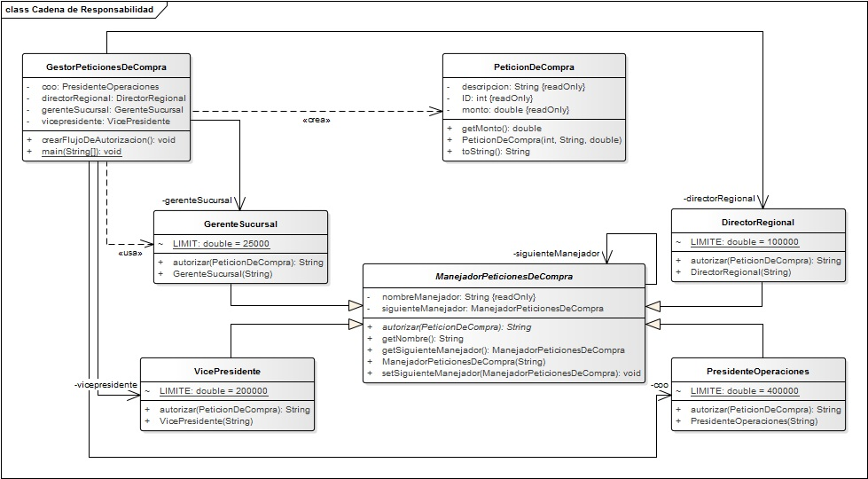
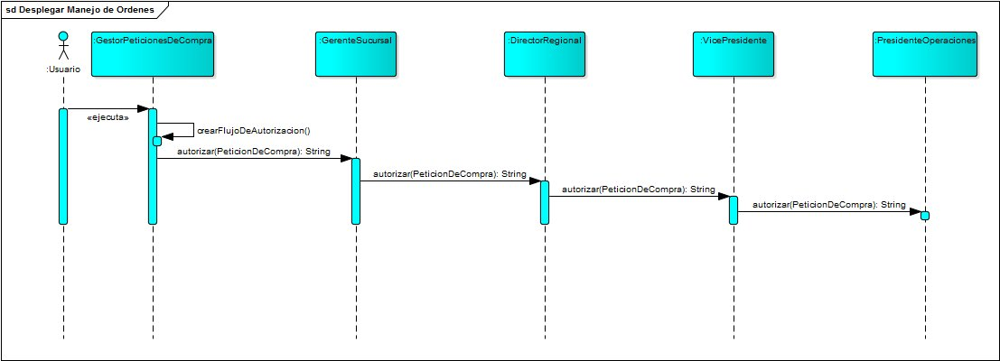

# Cadena de responsabilidad

Ejemplo de aplicación del patrón de diseño cadena de responsabilidad tomando como base el libro "Software Architecture Design Patterns in Java" de Partha Kuchana.

### Enunciado

Se requiere una aplicación que simule el proceso de autorización de peticiones de compra (PC) en una organización, dichas peticiones de compra deben ser autorizadas por un gerente en específico según el monto de la compra; se supone una organización con 4 gerentes involucrados en el proceso de autorización actualmente:

* Gerente de Sucursal - Monto máximo a autorizar: US$ 25,000
* Director Regional- Monto máximo a autorizar: US$ 100,000
* Vicepresidente- Monto máximo a autorizar: US$ 200,000
* Presidente de operaciones- Monto máximo a autorizar: US$ 400,000

### Solución propuesta

Para el desarrollo de dicha aplicación se propone la implementación del patrón de diseño cadena de responsabilidad que manejará las peticiones entre los diferentes gerentes de la organización dando la respuesta adecuada.

Siguiendo la estructura convencional del patrón se diseñó el diagrama de clases de la aplicación como se muestra a continuación.

Se diseñó el diagrama de interacción (no estricto) para mostrar el posible flujo que podrán tener las peticiones dentro de la aplicación.

